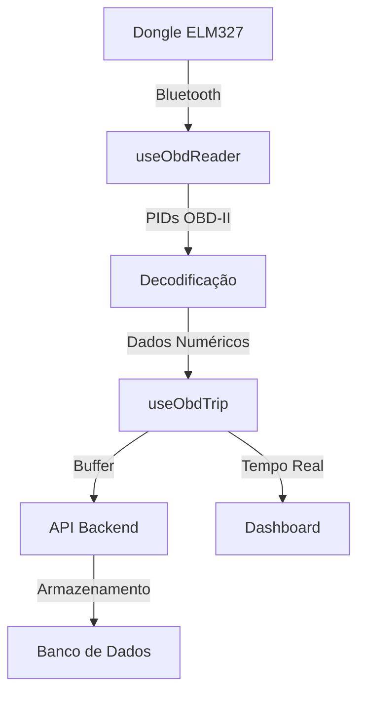

# 🚗 Implementação OBD-II no CarbonDrive Mobile

## 📋 Resumo da Implementação

Foi implementada uma integração completa de OBD-II no app CarbonDrive Mobile, permitindo a leitura de dados em tempo real do veículo através de dongles ELM327 Bluetooth.

## 🔧 Componentes Implementados

### 1. **useObdReader Hook** (`src/hooks/useObdReader.tsx`)
- **Funcionalidade**: Gerencia conexão Bluetooth com dongles ELM327
- **Recursos**:
  - Escaneamento de dispositivos Bluetooth
  - Conexão e desconexão automática
  - Leitura de PIDs OBD-II (RPM, MAF, Velocidade, etc.)
  - Decodificação de respostas hexadecimais
  - Inicialização automática do ELM327

### 2. **ObdConnectionScreen** (`src/screens/ObdConnectionScreen.tsx`)
- **Funcionalidade**: Interface para conexão com dispositivos OBD-II
- **Recursos**:
  - Lista de dispositivos disponíveis
  - Status de conexão em tempo real
  - Visualização de dados OBD
  - Instruções de uso

### 3. **useObdTrip Hook** (`src/hooks/useObdTrip.tsx`)
- **Funcionalidade**: Integra dados OBD com sistema de viagem
- **Recursos**:
  - Envio de dados em tempo real para API
  - Buffer de dados para envio em lotes
  - Sincronização com localização GPS
  - Tratamento de erros de conexão

### 4. **API OBD** (`src/services/api.ts`)
- **Endpoints**:
  - `POST /obd/data_stream` - Envio de dados individuais
  - `POST /obd/data_batch` - Envio de dados em lote
  - `GET /obd/history/{tripId}` - Histórico de dados OBD
  - `GET /obd/analytics/{tripId}` - Análises de dados OBD

## 📊 PIDs OBD-II Suportados

| PID | Descrição | Fórmula de Conversão |
|-----|-----------|---------------------|
| 010C | RPM do Motor | (A × 256 + B) ÷ 4 |
| 0110 | Mass Air Flow | (A × 256 + B) ÷ 100 |
| 010D | Velocidade | A |
| 0111 | Posição do Acelerador | (A × 100) ÷ 255 |
| 0104 | Carga do Motor | (A × 100) ÷ 255 |
| 012F | Nível de Combustível | (A × 100) ÷ 255 |
| 0105 | Temperatura do Motor | A - 40 |

## 🔌 Configuração de Permissões

### Android (`app.json`)
```json
"permissions": [
  "BLUETOOTH",
  "BLUETOOTH_ADMIN", 
  "BLUETOOTH_CONNECT",
  "BLUETOOTH_SCAN",
  "ACCESS_NETWORK_STATE"
]
```

### iOS (`app.json`)
```json
"infoPlist": {
  "NSBluetoothAlwaysUsageDescription": "Este app precisa acessar o Bluetooth para conectar com dispositivos OBD-II e monitorar dados do veículo.",
  "NSBluetoothPeripheralUsageDescription": "Este app precisa acessar o Bluetooth para conectar com dispositivos OBD-II e monitorar dados do veículo."
}
```

## 🚀 Como Usar

### 1. **Conectar Dispositivo OBD-II**
1. Acesse o Dashboard
2. Toque em "🔌 Conectar OBD-II"
3. Escaneie dispositivos Bluetooth
4. Selecione seu dongle ELM327
5. Aguarde a conexão ser estabelecida

### 2. **Iniciar Viagem com OBD-II**
1. Com o OBD-II conectado, toque em "🚗 Iniciar Viagem Eco"
2. Os dados do veículo serão lidos automaticamente
3. Dados são enviados para o servidor a cada 15 segundos
4. Visualize métricas em tempo real no dashboard

### 3. **Monitorar Dados**
- **RPM**: Rotações por minuto do motor
- **MAF**: Fluxo de massa de ar (g/s)
- **Velocidade**: Velocidade do veículo (km/h)
- **Acelerador**: Posição do pedal do acelerador (%)
- **Carga do Motor**: Carga atual do motor (%)
- **Combustível**: Nível de combustível (%)
- **Temperatura**: Temperatura do motor (°C)

## 🔄 Fluxo de Dados



## ⚠️ Limitações e Considerações

### **Managed Workflow vs Bare Workflow**
- **Atual**: Managed workflow (Expo Go)
- **Limitação**: `react-native-ble-plx` requer bare workflow
- **Solução**: Ejetar para bare workflow ou usar Expo Dev Client

### **Compatibilidade de Dispositivos**
- Funciona com dongles ELM327 Bluetooth
- Suporte para protocolos OBD-II padrão
- Testado com veículos 2008+ (compatibilidade OBD-II)

### **Performance**
- Leitura de dados a cada 1 segundo
- Envio para API a cada 15 segundos
- Buffer de 10 dados para envio em lote

## 🧪 Testando a Implementação

### **Pré-requisitos**
1. Dongle ELM327 Bluetooth
2. Veículo compatível com OBD-II
3. App rodando em dispositivo físico (não simulador)

### **Passos de Teste**
1. Conecte o dongle na porta OBD-II do veículo
2. Ligue o dongle (LED deve piscar)
3. Abra o app e vá para "Conectar OBD-II"
4. Escaneie e conecte com o dongle
5. Inicie uma viagem e verifique os dados

### **Verificações**
- [ ] Conexão Bluetooth estabelecida
- [ ] Dados OBD sendo lidos corretamente
- [ ] Dados sendo enviados para API
- [ ] Dashboard mostrando dados em tempo real
- [ ] Histórico salvando dados OBD

## 🔧 Próximos Passos

### **Para Produção**
1. **Ejetar para Bare Workflow**:
   ```bash
   npx expo eject
   ```

2. **Configurar Build Nativo**:
   - Android: `android/app/build.gradle`
   - iOS: `ios/CarbonDrive.xcworkspace`

3. **Testar em Dispositivos Reais**:
   - Testar com diferentes dongles ELM327
   - Validar com diferentes veículos
   - Otimizar performance de bateria

### **Melhorias Futuras**
- Suporte a mais PIDs OBD-II
- Análise de eficiência de combustível
- Detecção de problemas do veículo
- Notificações de manutenção
- Relatórios de condução eco-friendly

## 📚 Dependências Adicionais

```json
{
  "react-native-ble-plx": "^3.1.2"
}
```

## 🐛 Troubleshooting

### **Problemas Comuns**
1. **"Bluetooth não disponível"**
   - Verificar se Bluetooth está ativado
   - Verificar permissões no dispositivo

2. **"Serviço ELM327 não encontrado"**
   - Verificar se dongle está ligado
   - Tentar reconectar o dispositivo

3. **"Erro ao ler dados OBD"**
   - Verificar compatibilidade do veículo
   - Verificar se dongle está funcionando

4. **"Erro ao enviar dados"**
   - Verificar conexão com internet
   - Verificar se API está funcionando

## 📞 Suporte

Para problemas técnicos ou dúvidas sobre a implementação OBD-II, consulte:
- Documentação do `react-native-ble-plx`
- Especificação OBD-II (ISO 15031)
- Manual do dongle ELM327
